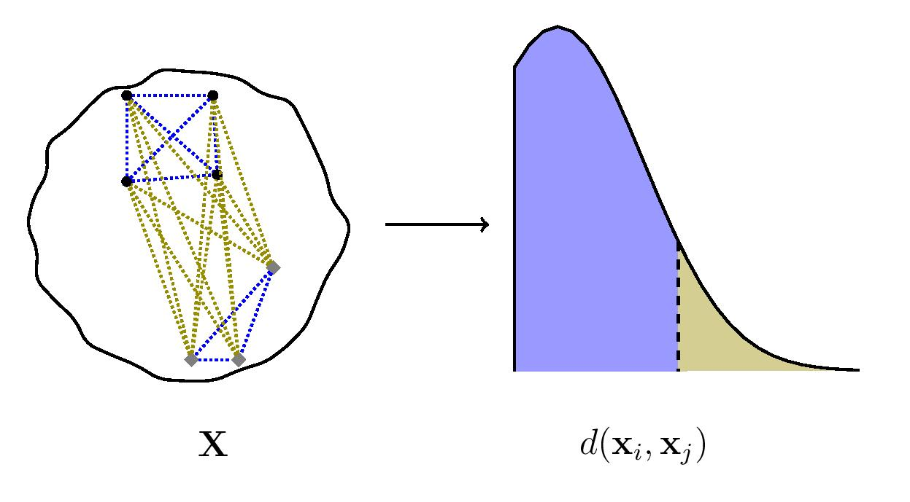

# A Simple and Flexible Test of Sample Exchangeability with Applications to Statistical Genomics

<i>
Given a cluster, dataset, or sample comprising multiple observations, the existence of subclusters, subgroups or stratification is accompanied by a wider spread of pairwise distances between the observations.
</i>

Welcome to the homepage of `flinty`, a method for assessing sample non-exchangeability, or heterogeneity, in multivariate datasets. Details of our method can be found in
> Aw, Spence and Song (2023) "A simple and flexible test of sample exchangeability with applications to statistical genomics," *Annals of Applied Statistics* (to appear). Preprint available at [arXiv:2109.15261](https://arxiv.org/abs/2109.15261).

## Python Users

Please visit the package homepage for **flintyPy** [here](https://songlab-cal.github.io/flinty). Our homepage provides installation instructions, as well as examples for using our methods.

## R Users

Please visit the package homepage for **flintyR** [here](https://alanaw1.github.io/flintyR). Our homepage provides installation instructions, as well as numerous tutorials that expand on analyses reported in our paper. 

## Software

While our documentation above should help you install our packages, our software is also available in the **software** subdirectory.

## Tutorials

Users unfamiliar with exchangeability can learn more about the topic here:

- [Introduction](https://alanaw1.github.io/flintyR/articles/intro.html)
- [Exchangeability and Homogeneity](https://alanaw1.github.io/flintyR/articles/ex_vs_hom.html)

With the kind help of domain experts from biology and the social sciences, we also offer integrative tutorials on the following topics:

- [Exchangeability in Single Cell ATAC-seq Analysis](https://alanaw1.github.io/flintyR/articles/single-cell-atac-seq.html)
- [Exchangeability and the World Values Survey](https://alanaw1.github.io/flintyR/articles/wvs.html)

Please feel free to use these tutorials for research or teaching purposes. We welcome any feedback or suggestions that will help make our work more accessible.
